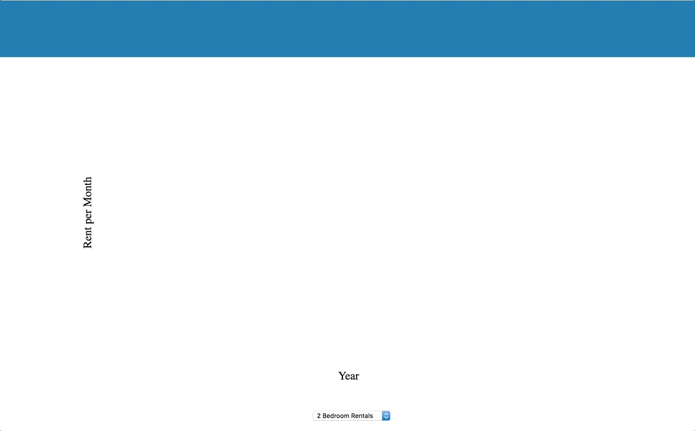

# d3-js-project
## Real Estate SF
* [Live Link](https://tedwildenradt.github.io/d3-js-project/)
### Background and Overview
   * Data visualization showing rental trends in San Francisco over time   
   * Purpose: Use D3.js to make the data dynamic and visually appealing.
### Architecture and Technologies
   * D3 - Data Driven Documents
   * Vanilla Javascript
   * HTML
   * CSS animations
### Data and APIs
   * Data was obtained from Zillow's historical real estate data
   * Data was parsed from csv files and made statically available on the website
### Functionality
   * Use accurate data from Zillow 
   * Parse the data from csv files
   * Site is displayed as a single page application
     
   * Site visitor can select which data they would like to see and the data will change in a visually appealing way.
    
### Code Snippets
   * D3 time parser that reformats the time from a string in the csv file into a more user friendly format.
   ```const timeFormatter = function(time) {
        const parseTime = d3.timeParse("%Y-%m")
        let formatTime = d3.timeFormat("%Y %B")
        return formatTime(parseTime(time));
      }```
   * D3 exit pattern
   ```  rects.exit()
    .transition(d3.transition().duration(750))
      .attr('y', y(0))
      .attr('height', 0)
      .remove()```
   * D3 update pattern 
   ```  rects.transition(t) 
      .attr('x', function(d, i) {return ((width1 / prices.length) * i)})
      .attr('y', function(d, i) {return y(d)})
      .attr('width',(width1 / prices.length - barPadding))
      .attr('height', function(d, i) { return height1 - y(d)})```